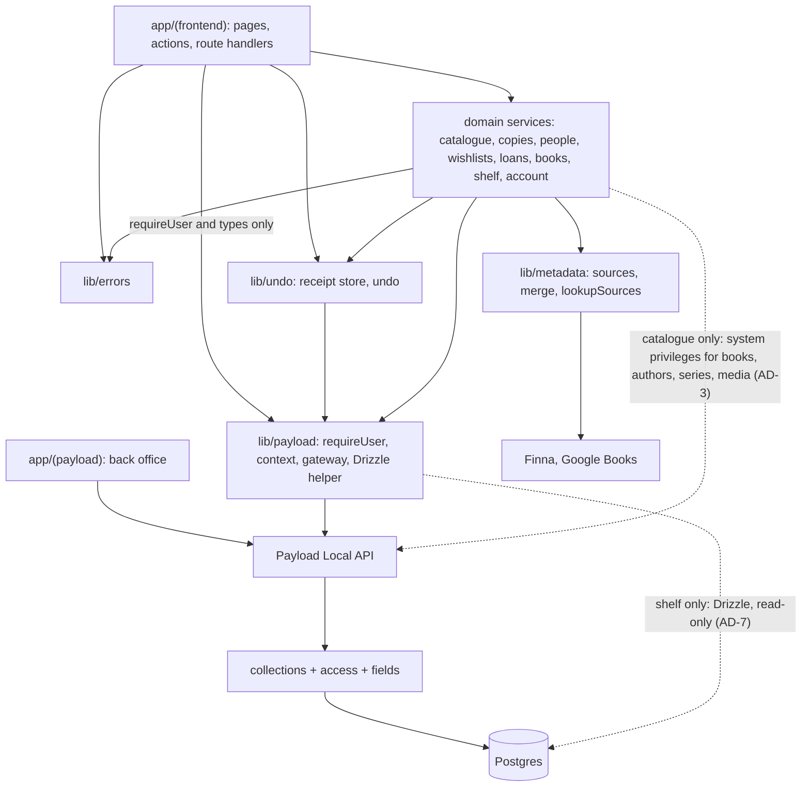
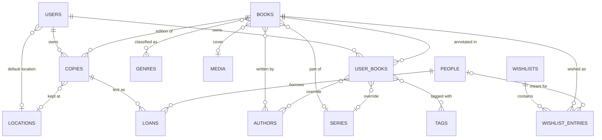
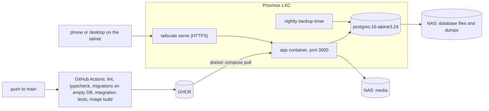

# Architecture Spine — Bookie

## Design Paradigm

Layered modular monolith in one Next.js process.

| Layer | Lives in | Owns |
| --- | --- | --- |
| Surface | `src/app/(frontend)` | Pages, server actions, route handlers, components. No business rules, no authorisation. It reads and writes data only through services. |
| Back office | `src/app/(payload)` | Payload admin, generated. Theme only. Edits rows as they are and triggers no service behaviour. |
| Services | `src/lib/*` | Behaviour that spans documents: lookup, save, edit, undo, effective Book, shelf queries, copies, People, loans, wishlists, the profile. |
| Data and authorisation | `src/collections`, `src/access`, `src/fields` | Schema, per-object access, single-collection invariants, database constraints. |
| Storage | Postgres 16, media directory | Rows and files. |



Arrows are the only allowed import directions, and ESLint `no-restricted-imports` enforces them.

- `src/lib` never imports from `src/app`. `src/collections` imports only from `src/access` and `src/fields`.
- `lib/metadata` has no database access.
- Between services, imports are one-way: `catalogue` may import `copies`, `wishlists`, `books` and `metadata`; `wishlists` and `loans` may import `copies` and `people`; `shelf` may import `books`; `tags` may import `books` and `shelf`; `copies`, `people`, `books` and `metadata` import no other service.
- `account` imports no other service.
- `lib/undo` imports only `lib/payload` and `lib/errors`. Any service may import it. `lib/errors.ts` and `lib/processState.ts` import nothing from the project, and any module under `src/lib` may import them.
- `src/app/(frontend)` imports from `lib/payload` only `requireUser`, `requireUserOrThrow` and types. It never calls the gateway.
- Client components import from `src/lib` only types and `lib/shelf/query.ts`, which is pure.

## Invariants & Rules

### AD-1 — One `owner` field on every private collection

- **Binds:** `copies`, `user-books`, `locations`, `people`, `tags`, `loans`, `wishlists`, `wishlist-entries`; FR-8, FR-9, FR-43, FR-48, Visibility table
- **Prevents:** `user` / `owner` naming drift; private rows without an owner; per-collection export and delete logic
- **Rule:** Every private collection includes `ownerField()` from `src/fields`: a required relationship to `users`, set by its hook from `req.user` on create, never accepted from input, never changed. The hook throws when `req.user` is absent. Read, update and delete access on these collections is `owner = current user` for every role, admin included.

### AD-2 — Authorisation lives in collection access functions only

- **Binds:** all collections, services, server actions and route handlers; FR-42, FR-48, Visibility table
- **Prevents:** permission checks scattered through pages and services; silent bypass (the Local API defaults to `overrideAccess: true`); reliance on Payload's permissive defaults
- **Rule:**
  - Every collection declares create, read, update and delete access explicitly. Read, update and delete return `where` constraints when the answer depends on the row; create returns a boolean.
  - Access functions test roles only through named helpers in `src/access` (for example `isAdmin`, `canEditShared`), never by reading `roles` inline.
  - `users`: a user reads and updates only their own document; admin reads all; create and delete are admin only; `roles` is writable only by admin.
  - Frontend-reachable code calls Payload only through the gateway in `src/lib/payload`, which always passes the context's user and `overrideAccess: false`.
  - Every page starts with `requireUser()`, which redirects to `/login?next=<path>`; sign-in returns to `next` only when it is a path on the same origin. Every server action and route handler starts with `requireUserOrThrow()`, inside `runAction()` or `runRoute()` (see Errors), and fails with `UNAUTHENTICATED` instead of redirecting. The sign-in page is the only exception in Phase 1.
  - Outside the modules in AD-3, nothing filters by user id as its means of authorisation.

### AD-3 — System privileges are an allowlist

- **Binds:** `src/lib/catalogue`, `src/lib/shelf`, the first-user seed, collection hooks
- **Prevents:** a convenience `overrideAccess: true` or raw query appearing in a feature story; hooks that read every user's rows
- **Rule:**
  - System privileges are allowed in three places: `src/lib/catalogue`, for writes to `books`, `authors`, `series`, `genres` and `media`, and for `isUnreferenced()`, a read-only check that no row of any user references a catalogue record; `src/lib/shelf`, for read-only Drizzle queries (AD-7); and the first-user seed in `onInit`. Adding to this list is a spine change.
  - Each such function takes the context (AD-16) and scopes by its user explicitly. It resolves every client-supplied id through the gateway before using it.
  - Private collections are always written through the gateway, also from `lib/catalogue`.
  - Hooks and access functions query only through `asRequestUser(req)` from `src/access`, which passes `req`, `req.user` and `overrideAccess: false`. Hooks never write to another collection.
  - The admin edits shared records from the app in three places, all in `src/lib/catalogue` and guarded by `canEditShared`: Edit book (`editBook()` writes the shared Book for an admin), genre management in Settings, and cover upload (AD-14). This is the deliberate exception to "admin edits shared records in the back office" (Mika, 2026-10-06).

### AD-4 — Shared and private catalogue records share collections, split by `visibility`

- **Binds:** `books`, `authors`, `series`, `genres`; FR-12, FR-17, FR-46, Glossary
- **Prevents:** a second private-Book collection; polymorphic relations on copies and wishlist entries; shared records pointing at private ones
- **Rule:**
  - `books`, `authors` and `series` carry `visibility: shared | private`. A private record has `createdBy`, set by hook from `req.user`; a shared record has none. `createdBy` is provenance of a private catalogue record, distinct from `owner` (AD-1). `genres` are shared only.
  - Read access for users is `visibility = shared OR createdBy = current user`; admin reads all. This is deliberately wider than the Visibility table; the no-browsing rule in AD-7 closes the gap.
  - At most one shared Book per ISBN-13, and at most one private Book per creator and ISBN-13. Both are database constraints (AD-19).
  - A shared Book references only shared authors and series.
  - `authors` include `sortNameField()` from `src/fields`: `sortName` in the form "Family, Given". `findOrCreateByName()` passes the source's inverted form when the source gives one; when `sortName` is empty on save, the field's hook derives it from `name`, last word first. An existing author keeps its `sortName`, unless a source passes an inverted form and the stored value is still the derived one. It is used for sorting only and never shown.
  - Promotion changes `visibility` and clears `createdBy` on the same row; it never copies rows.

### AD-5 — Catalogue records are written only by `lib/catalogue`, and shared values never come from the client

- **Binds:** save flow, Edit book, `src/lib/catalogue`, access on `books`/`authors`/`series`/`genres`; FR-11, FR-12, FR-13, FR-14, FR-17, FR-19
- **Prevents:** planted data in the shared layer; a save path and an edit path that disagree on what an override is; duplicate authors from different matchers
- **Rule:**
  - Users have no create, update or delete access on `books`, `authors`, `series` or `genres`, shared or private. Every user-initiated write goes through `src/lib/catalogue`. The admin edits shared records in the back office and, through `lib/catalogue`, on Edit book, in genre management and by cover upload (AD-3).
  - A shared Book's values are the merged source response held server-side for that ISBN (lookup cache, re-fetched on a miss). A save carries no Book values from the client, except the title and authors of a manual Book, which is private. With several candidates held for an ISBN it carries only `pick`, the index of the chosen candidate (AD-9).
  - Book values are edited after the save, only through `editBook()` in `lib/catalogue`. The client submits a sparse `BookEdits` object containing only the fields the user changed. The server never diffs. On a shared Book, a user's edits become their overrides (AD-6); an admin's edits are written to the shared Book itself (scalar fields, authors and series matched among shared records, system genres) and clear the admin's own override of each edited field. Themes are never edited. On the user's own private Book, edits update the Book itself. Personal tags and the copy's status and location submitted with the same edit are written in the same transaction through their own writers (AD-18).
  - Name matching is `findOrCreateByName()` in `lib/catalogue`, by `equals` on `nameKey` (see conventions), and is the only matcher; lookup and save both call it. For a shared Book it matches and creates among shared records only. For a private Book or an override it matches shared records first, then the user's own private ones, and creates private.
  - ISBN auto-share happens in two places and nowhere else: inside the save transaction, for the acting user's own private Book, when the server-held source outcome for its ISBN is `found` (AD-9) and no shared Book exists; and in `lookupAgain()`, which the creator runs from Book detail or the In library Answer, which calls the sources (rate-limited) and runs the same transaction without creating a copy. The save never calls the sources itself. Then: the row is kept, source values replace its fields, the creator's former values that differ become their overrides (an admin's are dropped), its authors and series are re-matched to shared records, `visibility` flips and `createdBy` clears. If a shared Book already exists, the user's copies, entries and `user-books` row move to it and the private Book is deleted. Other users' private Books are never touched.
  - System genres: on a shared Book, `books.genres` is written only by `mapSubjectsToGenres()` in `lib/catalogue`. It matches the Google Books categories in `rawMetadata.subjects.google` to `genres` by `nameKey` on the English name, creates the missing ones with no Finnish name, and can be re-run over stored subjects; until the genre stories land it returns none. The admin edits a shared Book's system genres on Edit book and manages the list (English and Finnish names, add, merge, delete) through `lib/catalogue`; a merge or delete touches shared rows only. On a private Book, genres are its creator's picks from the existing list, written by `editBook()`. Users have no write access on `genres`.
  - An ISBN can be added to a private Book through `editBook()`. A shared Book's ISBN never changes.
  - Re-fetch is an admin-only function in `lib/catalogue`, triggered by an admin-only action on the Book detail page. It fills empty shared fields only, themes and the cover included; an uploaded cover is an existing value. It never touches `user-books`.

### AD-6 — Overrides are a sparse layer on `user-books`, read for the viewer

- **Binds:** `books`, `user-books`, `editBook`, every screen that shows a Book; FR-14, FR-25, FR-27, FR-43, FR-46
- **Prevents:** copy-on-write forks; screens showing raw shared values; "cleared" and "not overridden" being confused; a friend's overrides leaking to a viewer later
- **Rule:**
  - `user-books` has at most one row per owner and Book. It holds the override fields, `overridden` (a `json` field holding the array of overridden field names), read flag, rating with `ratedAt`, and the user's tags of every kind (AD-8).
  - The overridable field set is declared once in `src/fields/bookFields.ts` and used by both collections. ISBN-13 is identity, the cover changes only through `setCover()` (AD-14), and genres and themes are system data; none of the four is overridable.
  - A field is overridden if and only if its name is in `overridden`; its stored value may then be empty, meaning cleared. Relationship overrides (`authors`, `series`) are relationship fields to the same collections. A typed author or series name that matches nothing becomes a private record (AD-5). A user classifies a shared Book for themselves with user genres and user themes, which are tags (AD-8), not overrides.
  - Overrides exist only on shared Books.
  - The override row is always the viewer's: `user-books` is joined on the requesting user, never on the owner of a copy or entry. A viewer with no row gets shared values.
  - The row is lazy. `upsertUserBook()` in `lib/books` is its only writer. Every reader treats a missing row as no overrides, unread, unrated, no tags. It is not deleted when copies or entries are removed.
  - Surface code receives only `EffectiveBook` and `UserBookState` from `lib/books`; it never reads a `books` document.

### AD-7 — One shelf query module answers list, filter, sort and search

- **Binds:** `src/lib/shelf`; collection, Filter panel, Lookup's own-library results, Book detail and Edit book entry; FR-20, FR-23, FR-24, FR-25, NFR-3, NFR-7
- **Prevents:** each list screen re-implementing effective-value logic, visibility or paging; the first rows and later rows built by different code; rows skipped or stale after a change; URL parameters named differently per screen; inconsistent Finnish ordering; a path that browses the shared catalogue
- **Rule:**
  - Any query that filters, sorts or searches copies on Book fields goes through `src/lib/shelf`, built with Drizzle through the helper in `lib/payload`. It is read-only. One row is one copy.
  - Every shelf query is built on one `visibleCopies(viewer)` fragment, the only place that decides which copies a viewer may see (today `owner = viewer`), and applies the AD-4 read constraint in its joins to `books`, `authors` and `series`.
  - Effective values in SQL test whether the field's name is in `overridden`, and are used for filter and sort only. Filter fields combine with AND; several values in one field combine with OR. An author or series filter value is an id, and it matches every readable record with that record's `nameKey`.
  - `getShelfRows(ctx, query, range)` is the one hydrated read. It takes the ordered ids from the Drizzle query and hydrates them through `getEffectiveBooks()` and `getHoldings()` in `lib/books`, so rendering has one effective-value implementation. It also returns the total and the display names of the filter values in the query. The collection page calls it for the first rows; the `/data/shelf` handler calls it for any other range.
  - Paging is by offset and limit with one fixed page size, and every sort ends on copy id. The page number is not in the URL.
  - One client list component holds the loaded rows, keyed by the shelf query without `book`. After any successful action or Undo that can change rows, it reloads rows 0 to the number it holds through `/data/shelf`. Rows are never patched locally. Per shelf query, the list keeps in `sessionStorage` only how many rows it held and the scroll position, never row data; on return from another route it loads that many rows in one request, up to a fixed cap, and restores the position.
  - Search, filters, sort and the open Book live in URL search params. `parseShelfQuery()` and `shelfHref(query, { book })` in `lib/shelf/query.ts` are the only code that reads or writes them; a Filter chip is a link built with `shelfHref()`.
  - The values a filter offers (locations, genres, tags, languages in use), their copy counts, and the suggestions for author, series and publisher are shelf queries on `visibleCopies`. Suggestions are distinct on `nameKey` and prefer the shared record's id.
  - Text sort relies on the database's `fi-FI` ICU collation. Author sort uses the `sortName` of the Book's first effective author. Text search is `ILIKE` with no accent folding.
  - No code lists or searches `books`, `authors` or `series` on their own. They are reached through a copy or wishlist entry the viewer can see, or by exact match on ISBN-13 or `nameKey`. Book detail, Edit book and every `{ bookId }` a client sends start with `requireOwnBook(ctx, bookId)` in `lib/books`, which fails with `NOT_FOUND` unless the viewer has a copy or an open wishlist entry of that Book.
  - Lookup's own-library results are a shelf text search over the viewer's copies and open wishlist entries, the entries through a `visibleEntries(viewer)` fragment that mirrors `visibleCopies`. Every other list that is not copies (loans, a wishlist) hydrates Books through `getEffectiveBooks()` and does not sort or filter on Book fields.

### AD-8 — Status, wishlist, loan and reading state each have one home

- **Binds:** `copies`, `wishlist-entries`, `loans`, `user-books`; FR-28, FR-29, FR-35, FR-38
- **Prevents:** `wishlist` or `loaned` reappearing as a copy status or location; read and rating stored per copy
- **Rule:**
  - `copies.status` is `ordered | owned` and nothing else. An ordered copy has no location.
  - A wishlist entry is a row in `wishlist-entries`, never a copy. Marking it bought or ordered closes it, and a closed entry keeps its row with `closedAt`; Remove deletes the row. Unless a rule says otherwise, "entry" means an open entry. An entry is addressed by its own id, because one Book can be on a list more than once.
  - A loan is a row in `loans` pointing at a copy and a Person; the copy keeps its location.
  - Read flag, rating and the user's tags are on `user-books`; notes are on `copies`. Personal tags, user genres and user themes are one `tags` collection with `kind: tag | genre | theme`. A user's name in a kind may not equal a system genre's English or Finnish name, nor a system theme on a Book the user holds (`SYSTEM_NAME`). A system genre created later with a user genre's name leaves the user genre in place.

### AD-9 — Lookup is read-only, has two layers and merges sources by priority

- **Binds:** `src/lib/metadata`, `lookupBook` and `searchBooks` in `src/lib/catalogue`; FR-10, FR-11, FR-12, FR-16, FR-18, FR-20, FR-22, NFR-1
- **Prevents:** adapters with different result shapes or error behaviour; lookup creating records; a rescan of a hand-entered Book creating a duplicate; a source outage cached as "no such book"; raw source data reaching other users
- **Rule:**
  - Lookup writes nothing to the database.
  - `lookupSources(isbn13)` in `lib/metadata` calls every source in `sources/index.ts` in parallel, each under a timeout. A source's `lookupByIsbn` returns its matching records best first. `lookupSources` builds one candidate per record of the first source that answered, each gap-filled field by field from the other sources' best record in array order (Finna, then Google Books). It reports one of three outcomes: `found`, with the candidates best first and `RawMetadata`; `none`, when every source answered and none has the ISBN; or `unavailable`, when there is no result and at least one source failed or timed out. A source that has failed or timed out several times in a row is skipped for a cooldown (a circuit breaker in process state, AD-12) and counts as failed. Results and `none` are cached in process by ISBN-13. `unavailable`, and a result merged while a source failed or timed out, are never cached.
  - A source implements `id`, `lookupByIsbn(isbn13)` and optionally `search(query)`. It returns a list of `SourceResult`, empty for none, and never throws to the caller; failures are logged. A result carries the ISBN asked for, never another ISBN in the record; `binding` is display-only and never stored. Finna's subject terms become `themes`; a source's own categories are kept as its `subjects`. Adapters emit person names as "Given Family", with the source's inverted form as `sortName` when it gives one, and convert language codes. Adding a source is one adapter file and one array entry, with no schema change.
  - `lookupBook(ctx, target)` in `lib/catalogue` returns `LookupResult`. It takes the ISBN as entered and normalises it. The order is: a Book the user can read with that ISBN (shared first, then the user's own private Book), then `lookupSources`. When the answer is the user's own private Book, it also runs `lookupSources`, so the next save can auto-share it (AD-5). For a Book id it answers only for a Book that passes `requireOwnBook()` (AD-7). The `source` kind carries the candidates and the matches for the picked one; the Answer selects a candidate with `?pick=<n>`, an out-of-range pick falls back to the best, and once a shared Book exists for the ISBN there is nothing to pick.
  - What the user holds of a Book comes from `getHoldings()` in `lib/books`, the one reader of a viewer's copies and open entries of a Book. The Answer, Book detail, shelf rows and Lookup results all use it.
  - `searchBooks(ctx, text)` in `lib/catalogue` is the only caller of the sources' `search()`. It merges hits in source order, keeps one hit per ISBN-13 with its `binding` and drops hits without one. It writes nothing.
  - `books.source` is a text field holding the id of the first source in order that answered, empty for a manual Book.
  - `rawMetadata` has the `RawMetadata` shape, admin-only field read access, and is never part of `EffectiveBook`.
  - `lookupBook`, `searchBooks` and `lookupAgain` share one per-user rate limit, in process. There are no custom Payload endpoints.

### AD-10 — The frontend does not use Payload REST or GraphQL

- **Binds:** `src/app/(frontend)`; FR-20, FR-49, NFR-5
- **Prevents:** a client fetch to `/api/*` that would force the back office surface onto a public ingress later; reads implemented as actions in one story and routes in another
- **Rule:**
  - Reads happen in server components through services. This includes the Answer, which the `/scan` page renders from its search params; the browser makes no lookup request of its own. Mutations are server actions whose body runs inside `runAction()` (see Errors).
  - Client-initiated reads (other shelf rows, filter suggestions, cover preview) are route handlers under `src/app/(frontend)/data/`, outside `/api`, whose body runs inside `runRoute()`.
  - GraphQL is disabled and its route folders are deleted. Nothing under `(frontend)` requests `/api/*` or `/admin/*`, with one exception: media file URLs, produced only by `coverUrl()` in `lib/books` and rendered only by the `Cover` component, a plain `img` with no `next/image` optimiser.

### AD-11 — A save is one transaction and carries no edits

- **Binds:** `saveCopy` and `saveEntry` in `src/lib/catalogue`, Answer screens; FR-15, FR-21, FR-28
- **Prevents:** half-saved books; a second route to Book values beside `editBook`; a double tap saving twice; a guessed Book id reaching the shared catalogue; Undo of a save deleting a record still in use
- **Rule:**
  - A save takes `SaveInput` and creates every needed document in one transaction (AD-16): ensure the Book, then either `closeEntriesForBook()` and `createCopy()` (AD-18) or the new entry. A copy saved this way is owned and at the default location. Status, location, tags, the recipient of an entry and Book values are changed afterwards through their own functions.
  - An Answer opened by ISBN sends `{ isbn13, pick? }`. A `{ bookId }` target must pass `requireOwnBook()` (AD-7).
  - `SaveInput` carries a client-generated `requestId`. A repeat of a recent `requestId` by the same user returns the first result.
  - A save is undoable (AD-20). Its restore deletes the copy or entry and reopens closed entries. It deletes a created Book, author, series or media row only when `isUnreferenced()` (AD-3) finds no reference to it from any row of any user, and a created `user-books` row only when that user has no other copy or entry for the Book. After an auto-share (AD-5) it removes the copy and leaves the Book shared. If the copy has gained a loan since the save, the restore fails with `UNDO_FAILED` and changes nothing.

### AD-12 — Exactly one app instance

- **Binds:** deployment, lookup cache, rate limiter, Undo receipts (AD-20), `requestId` memory; NFR-4
- **Prevents:** a story adding Redis or a table for state that fits in memory; a story assuming state survives a restart
- **Rule:** The app runs as a single container. In-process state is allowed, must be bounded, and must be safe to lose on restart. It is created only through `processState(key, init)` in `src/lib/processState.ts`, which keeps it on `globalThis`: a module-level variable is not shared between pages, server actions and route handlers in the built app.

### AD-13 — Schema changes ship as committed migrations that compose

- **Binds:** every story that changes a collection; CI; deployment
- **Prevents:** production schema drifting from dev; a story that works only under push; two schema stories whose migrations conflict
- **Rule:**
  - Dev uses Payload push. A story that changes schema commits the generated migration under `src/migrations` and the regenerated `src/payload-types.ts` in the same change. `payload migrate` is never run against a dev database.
  - Schema-changing stories merge one at a time. After rebasing, the story deletes its own migration and regenerates it.
  - CI applies all migrations to an empty database, runs the integration tests against it with push off, and fails if generating a migration produces changes.
  - Production applies migrations at start through `prodMigrations` and never pushes.
  - The old single-copy collections are replaced, not migrated. Migration history starts with the reworked model.

### AD-14 — Covers are stored locally; downloaded and uploaded only by `lib/catalogue`

- **Binds:** `media`, save flow, every cover render; FR-13, FR-20, FR-47
- **Prevents:** two downloaders; screens rendering remote source URLs; a slow download holding a transaction open
- **Rule:**
  - Only `lib/catalogue` downloads covers, never a hook. The URL is taken from the server-held source response. Bytes are fetched before the transaction opens and the media row is created inside it. A failed download saves the Book without a cover and logs; a rolled-back save deletes the file it wrote. Downloads use `https` from an allowlist of source image hosts, with a size limit and a timeout. Files are written under a temporary name and renamed into place when complete; `onInit` removes files without a `media` row that are older than an hour.
  - The browser never loads a cover from a metadata source. The cover of a Book that is not saved yet is shown through one authenticated route handler under `(frontend)` that streams it for an ISBN-13 from the source cover URL the server recorded for that ISBN during a lookup or a search; `coverUrl()` produces that URL too. The handler never takes a URL from the client.
  - `setCover(ctx, bookId, file, corners)` in `lib/catalogue` is the only upload path: the admin for a shared Book, the creator for their private Book; anyone else fails with `NOT_FOUND`. It accepts JPEG, PNG or WebP within a size limit, warps the four-corner quadrilateral into a 2:3 rectangle with sharp (a closed-form square-to-quad projective mapping with bilinear sampling, hand-written; no crop library, no general solver), strips all metadata, resizes and re-encodes, creates the `media` row with a random filename and sets `books.cover`; the replaced row is deleted when `isUnreferenced()`. `removeCover()` clears the cover. Neither is undoable. The browser decodes the photo with its orientation applied, shrinks it to about 2000 px and sends the image and the four corner points in a server action, whose body size limit is raised for it.
  - `media` carries `visibility: shared | private` and `createdBy` as in AD-4: a source-downloaded cover and the admin's upload on a shared Book are shared; a private Book's cover is private, readable by its creator and the admin. Read requires a signed-in user and follows that constraint. Create and delete are `lib/catalogue` or admin only. Stored filenames are random.

### AD-15 — Interface text goes through the message catalogue

- **Binds:** all frontend stories; FR-51
- **Prevents:** hard-coded strings; locale in the URL in some routes and not others
- **Rule:** Every interface string comes from `messages/en.json` and `messages/fi.json` through `next-intl`. The locale is the signed-in user's profile language. Pages without a signed-in user use `Accept-Language`, falling back to `en`. Routes carry no locale segment. A story that adds a string adds both languages.

### AD-16 — One context carries the user and the transaction

- **Binds:** `src/lib/payload`, every service function, `ownerField()` and `createdBy` hooks; AD-2, AD-3, AD-11
- **Prevents:** a save that is not atomic because the gateway opened its own request; owned rows created without a user; Drizzle reads that miss rows written earlier in the same transaction
- **Rule:** `requireUser()` returns a context holding the request and its user. `withTransaction(ctx, fn)` in `lib/payload` is the only place a transaction is opened and hands `fn` a context that also carries the transaction. Called with a context that already carries one, it joins it. A context is never kept beyond its request. Every gateway function, every system-privilege function and the Drizzle helper take a context and use its transaction when it has one. The first-user seed and tests build a context with an explicit user; nothing passes `owner` or `createdBy` as data.

### AD-17 — Relationship targets are authorised

- **Binds:** every relationship field on a private collection, `users.defaultLocation`; Visibility table
- **Prevents:** a copy that points at another user's location or private Book; a loan on someone else's copy
- **Rule:** Every relationship field on a private collection, and `users.defaultLocation`, is built with `ownedRelation(slug)` or `readableRelation(slug)` from `src/fields`. Its validation re-reads the target through `asRequestUser(req)` and rejects when the target is not readable. Each collection's access test covers a foreign id.

### AD-18 — One writer per kind of row, one home per rule

- **Binds:** `lib/copies`, `lib/people`, `lib/books`, `lib/wishlists`, `lib/loans`, `lib/account`, `lib/catalogue`; FR-4, FR-17, FR-28, FR-31, FR-33, FR-34, FR-35
- **Prevents:** three modules creating copies with different default-location and wishlist behaviour; a screen writing a row through the gateway; the same rule enforced twice with different errors; deletes failing on foreign keys; a screen looping single actions for a selection and stopping half way; a picker that takes an id on one screen and a name on another
- **Rule:**
  - `lib/copies` is the only writer of `copies`. `createCopy()` is its only insert; move, receive, set status, set note and remove are its other functions, and `editBook()` calls them. A `location` of `undefined` on an owned copy means the profile's default location; `null` means none; no hook sets a default. Setting a copy to ordered clears its location; Received makes it owned at the default location.
  - `lib/wishlists` is the only writer of `wishlist-entries`. `closeEntriesForBook()` closes the user's open entries for a Book that have no recipient; `saveCopy()` calls it before `createCopy()`, in the same transaction, and folds what it closed into the save's restore. `closeEntry()` marks an entry bought or ordered and calls `createCopy()` unless the entry is for a Person.
  - `upsertUserBook()` in `lib/books` is the only writer of `user-books` (AD-6). `setRead()` in `lib/books` and `changeTags()` in `lib/tags` take either copy ids or a Book id, so they also work for a Book the user has only on a wishlist. `setRead()` takes a value or `toggle`, which the server resolves: unread when every Book is read, otherwise read.
  - `findOrCreateByName()` in `lib/catalogue` is the only matcher for authors and series (AD-5).
  - Each private name-keyed collection has one owning service that matches by `nameKey`, creates, renames and deletes its rows, and merges them where the interface offers a merge: locations in `lib/copies`, People in `lib/people`, tags of every kind in `lib/tags` (which reads system genre names and, through `lib/shelf`, system theme names for `SYSTEM_NAME`), wishlists in `lib/wishlists`. The profile, `profileVisibility` and `collectionVisibility` included, is read and updated only through `lib/account`. System genres are managed only through `lib/catalogue`, admin only. Screens never match names.
  - An input that picks one of these rows or creates it inline is a `Ref`: an id, or a name to create. The owning service resolves it inside the action's transaction. Undo leaves a row created this way.
  - Renaming onto a `nameKey` that exists fails with `NAME_TAKEN` and the existing row's id as `conflictId`.
  - A merge is one function in the owning service, in one transaction: every reference to the source row moves to the target, then the source row is deleted.
  - Deletes that affect other rows are one function in the owning service, in one transaction: deleting a copy deletes its loans; a Person with a loan or a wishlist entry, open or closed, cannot be deleted; deleting a location clears it from copies and from the profile default; deleting a wishlist deletes its entries. A merge or delete updates referencing rows of other collections through the gateway.
  - Every action the interface offers on a selection (move, tag, read, remove) is a service function that takes a list of copy ids and runs in one transaction, all or none. Tag and read apply to the distinct Books of those copies. The single-row action calls the same function with one id.
  - The use count shown beside a location or tag is its number of copies, from the shelf values (AD-7). A Person's count is loans and entries, from `lib/people`; a wishlist's is its open entries.
  - An invariant on one collection is enforced in that collection's hooks. An invariant across collections is enforced in the owning service.

### AD-19 — Invariants the database can express are database constraints

- **Binds:** `books`, `user-books`, `loans`, name-keyed collections; back office
- **Prevents:** back-office edits or concurrent saves breaking a rule that only a service checks
- **Rule:** These are unique constraints, declared in the collection config or through the Postgres adapter's `afterSchemaInit`, and present from the first migration that creates the table:
  - `books(isbn13)` where `visibility = shared`; `books(createdBy, isbn13)` where `visibility = private`
  - `user-books(owner, book)`
  - `loans(copy)` where the loan is open
  - `nameKey` among shared rows, and `(createdBy, nameKey)` or `(owner, nameKey)` among private rows; `(owner, kind, nameKey)` for `tags`

  A service check for the same rule exists only to raise a `DomainError` first.

### AD-20 — Undo is one mechanism: server-held receipts in `lib/undo`

- **Binds:** `src/lib/undo`, every service function behind an action in `EXPERIENCE.md` → Undo, the toast, `undoAction`; FR-15
- **Prevents:** one Undo per screen; the browser holding previous values; nested calls each recording a receipt, or none; a restore writing outside its transaction; a forged receipt deleting shared records; Undo reverting changes it did not make
- **Rule:**
  - `lib/undo` holds a bounded in-process store (AD-12) of receipts keyed by an opaque `undoToken` and the user. The client holds only the token. Receipts live 30 minutes; a result carries the seconds remaining on its token and the toast hides Undo when they run out. After a restart or once the token has expired, Undo is unavailable.
  - An undoable service function is written once. It takes a context, opens no transaction, records nothing, and returns `Undone<T>`: its result and a restore function. The restore closes over ids and previous values only, never a context.
  - `withUndo(ctx, fn)` in `lib/undo` is the only recorder. It opens the transaction, runs `fn`, records the restore after the commit and returns the result with its `undoToken`. A server action wraps its one service call in it. A service that calls an undoable function of another service folds the returned restore into its own or drops it.
  - `undo(ctx, token)` is the only entry point, behind one `undoAction`. It uses the token once and runs the restore in one transaction with the context of the undo request, through the owning services' writers (AD-18). A restore writes the recorded previous values to rows that still exist, whatever they hold now, and skips rows that are gone. It never touches a row its action did not change. If any step fails, nothing is restored and the result is `UNDO_FAILED`.
  - The actions that are undoable are exactly those listed with an Undo in `EXPERIENCE.md` → Undo, whichever screen they are called from. Removals, deletes, merges, `editBook`, `setCover`, `lookupAgain` and genre administration are not.

## Consistency Conventions

| Concern | Convention |
| --- | --- |
| Collection naming | Slugs plural kebab-case (`user-books`, `wishlist-entries`). One file per collection, PascalCase (`UserBooks.ts`). Fields camelCase. |
| Service naming | One folder per domain under `src/lib`, named exports, verb-first (`saveCopy`, `editBook`, `lendCopy`). Server actions end in `Action`. One used by a single page lives in `actions.ts` beside it; one used from several pages lives in `src/app/(frontend)/actions/<domain>.ts`. |
| Ids | Payload default integer ids. Users are referenced by id only; email is a mutable attribute. |
| Accounts | `users` is the only auth collection, with Payload's local strategy and server-side sessions left on. A later sign-in provider, email delivery or open registration is added to this collection. |
| Roles | `users.roles` holds `admin` and/or `user`. Only `admin` may enter the back office. |
| ISBN | `normaliseIsbn` lives in `src/fields` with the ISBN field. Input is normalised to 13 digits by the service that first receives it; stored and compared only in that form. The browser never normalises: services take the text as entered and fail with `INVALID_ISBN`. |
| Names | `authors`, `series`, `genres`, `tags`, `locations`, `people` and `wishlists` include `nameKeyField()` from `src/fields`: a hook-maintained `nameKey` (trimmed, inner whitespace collapsed, lower-cased). Matching is `equals` on `nameKey`. No accent folding anywhere. |
| Text input | Text from sources and from users is trimmed and normalised to NFC at the adapter or action boundary. |
| Language codes | ISO 639-1 two-letter where one exists, otherwise ISO 639-2. Adapters convert. |
| Dates | ISO 8601 UTC as Payload stores them. A loan date is a calendar date: sent as `YYYY-MM-DD`, stored at 12:00 UTC, read back by its UTC date. Every date and number shown is formatted by `next-intl`, with the time zone `Europe/Helsinki` set once in its request config. |
| Errors | `src/lib/errors.ts` defines `DomainError`, `ActionResult`, the `ErrorCode` union (`SCREAMING_SNAKE`), `runAction()` and `runRoute()`. The message key for a code is `errors.<CODE>`. Both wrappers map Payload `Forbidden` and `NotFound` to `NOT_FOUND`, `ValidationError` to `VALIDATION` with field errors, and anything else to `INTERNAL` with a log line. Actions return `ActionResult` and never redirect. `runRoute()` answers with `ActionResult` as JSON, `Cache-Control: no-store`, and status 401 for `UNAUTHENTICATED`; the cover handler streams bytes and uses the status alone. On the client, actions and `/data` requests go through one helper, which turns a network failure into `NO_CONNECTION` and `UNAUTHENTICATED` into a move to sign-in. |
| Toasts | One toast provider in the frontend root layout, so a toast survives navigation. It renders from `ActionResult`; an action's result carries the names its toast shows and the seconds remaining on its `undoToken`. Every toast has a close (X). A server render raises a toast only through `flashToast()`, a short-lived cookie the provider reads and clears. |
| Navigation and history | Opening Book detail, an entry or a full-screen task pushes a history entry. Swapping the open Book, changing search, filters or sort, and one Answer following another replace it. Closing is history back, falling back to `/` when there is nothing to go back to; no address carries a return parameter. Overlays without an address (pickers, dialogs, the Filter sheet on the phone) handle Back inside their `components/ui` wrapper. Overlay links use router navigation with `scroll: false` and no prefetch. `cacheComponents` stays off. |
| Logging | `payload.logger`. No `console.*` in committed code. |
| Configuration | Environment variables only, each listed in `.env.example`. |
| Caching | No shared or cross-request caching of anything derived from user data. No service worker. |
| Device preferences | Layout, size, theme and loans order live in one cookie, `bookeh_prefs`. `devicePrefs()` in `src/app/(frontend)/prefs.ts` reads it at render; one server action writes it. They are never stored on the profile. A missing or unknown value falls back to the default. Interface language is not a device preference; it stays on the profile (AD-15). |
| Styling | Tailwind CSS 4. The tokens are those of `DESIGN.md`, declared under the same names as Tailwind theme variables in `src/app/(frontend)/styles.css` and nowhere else. Dark values apply under `data-theme="dark"` on the root element, and under `prefers-color-scheme: dark` when the theme preference is `system`. `styles.css` clears Tailwind's default colour, radius, shadow and font scales, so only these tokens resolve; a size `DESIGN.md` gives outside its scale is declared there as a named variable. No `dark:` utilities, no CSS Modules, no inline style objects, no colour or size literals in components. |
| UI primitives | Dialog, sheet, combobox, menu and the other overlays come from Base UI, each wrapped once in `src/app/(frontend)/components/ui`. Screens import the wrappers, never `@base-ui/react`, and ESLint enforces it. The side panel on wide screens is plain layout, not a drawer. No other component library and no animation library; motion is CSS transitions or view transitions. |
| Font | Open Sans through `next/font`, loaded once in the frontend root layout. The browser makes no request to a font host. |
| Product name | The interface says "bookeh", from the message catalogue and the manifest. Documents may say Bookie. |
| Types | Strict TypeScript. `any` only for `rawMetadata`, enforced as a lint error. Payload generated types are the document types. |
| Framework APIs | Read the bundled guide in `node_modules/next/dist/docs` before using a Next.js API, and the current Payload docs before touching admin overrides. |
| Story size | One concern per story: one collection, one service or one screen. About 300 hand-written changed lines. Generated files (`payload-types.ts`, migrations, lockfile, import map) do not count. |
| Tests | Tests run against database `bookeh_test`, never the dev database. `tests/helpers/harness.ts` provides `createUser()` and `as(user)`; tests create their own rows and never truncate. A collection story ships a two-user access test; a service story ships integration tests; the shelf module runs the two-user test too. Pure functions get `*.unit.spec.ts`. No test reaches the network: adapters are tested against recorded responses in `tests/fixtures/<source>/`. A service function that records an Undo receipt ships a test that undoes it. Playwright covers only scan-to-save and shop check, with a fixture source and ISBNs entered by hand. The fixture source joins `sources/index.ts` only when `BOOKEH_SOURCES=fixture`, which the app refuses under `NODE_ENV=production`; its covers come from a local test route that is on the cover allowlist only under that setting. |
| Commits | One conventional commit per story. |

## Stack

| Name | Version |
| --- | --- |
| TypeScript | 5.7.3 |
| Node.js | 22 (image `node:22.23.3-alpine`; the Dockerfile has 22.17.0) |
| Next.js | 16.3.8 (installed 16.3.3; bump first, security fixes) |
| React | 19.2.6 |
| Payload (`payload`, `@payloadcms/next`, `@payloadcms/db-postgres`, `@payloadcms/ui`) | 3.90.2 (installed 3.88.0; bump before the first migration, security fixes) |
| Drizzle ORM (via `@payloadcms/db-postgres/drizzle`, not a direct dependency) | 0.45.2 |
| PostgreSQL | 16 (`postgres:16-alpine3.24`, ICU locale `fi-FI`) |
| Tailwind CSS with `@tailwindcss/postcss` (to add) | 4.3.3 |
| Base UI, `@base-ui/react` (to add) | 1.8.0 |
| Open Sans via `next/font/google` (variable, weights 300 to 800; downloaded when the image is built, served by the app) | with Next.js 16.3.8 |
| next-intl (to add) | 4.14.9 |
| @zxing/browser with peer `@zxing/library` (to add) | 0.2.1 with ^0.23.0 |
| Vitest | 4.0.18 |
| Playwright | 1.58.2 |
| sharp (already a Payload dependency) | as installed; used by `setCover()` for the cover warp |
| Docker Compose | v2 |
| GitHub Actions and GHCR | hosted |
| Tailscale (`tailscale serve`) | current stable on the LXC |

## Structural Seed

The code owns everything in this section once it exists.

### Entities



`owner` edges (AD-1) and `createdBy` edges (AD-4) are drawn only where shown; every private collection has an owner.

### Shared shapes

Each type is declared in the module named and imported from there.

```ts
// src/lib/metadata
type SourceId = string // 'finna', 'google', ...
type SourceResult = {
  isbn13: string
  title: string
  subtitle?: string
  authors: { name: string; sortName?: string }[] // "Given Family"; "Family, Given"
  series?: string
  seriesIndex?: number
  publisher?: string
  year?: number
  language?: string
  pages?: number
  description?: string
  subjects: string[]
  themes: string[] // Finna subject terms as given
  binding?: string // "paperback", "hardcover"; display only, never stored
  coverUrl?: string
  source: SourceId // first source in order that answered
  raw: Record<SourceId, unknown>
}
type SourcesOutcome = { kind: 'found'; candidates: SourceResult[]; raw: RawMetadata } | { kind: 'none' } | { kind: 'unavailable'; failed: SourceId[] } // candidates best first; failed names the sources that failed or timed out
type SearchHit = Pick<SourceResult, 'isbn13' | 'title' | 'authors' | 'publisher' | 'year' | 'binding' | 'source'> & { hasCover: boolean }
type RawMetadata = {
  v: 1
  fetchedAt: string
  sources: Record<SourceId, unknown>
  subjects: Record<SourceId, string[]>
  coverUrl: string | null
}

// src/lib/payload
type Ref = number | { create: string } // an existing row, or a name to create

// src/lib/books
type Named = { id: number; name: string }
type EffectiveBook = {
  bookId: number
  isbn13: string | null
  visibility: 'shared' | 'private'
  source: SourceId | null
  title: string
  subtitle: string | null
  authors: Named[]
  series: Named | null
  seriesIndex: number | null
  genres: Named[] // system genres
  themes: string[]
  publisher: string | null
  year: number | null
  language: string | null
  pages: number | null
  description: string | null
  coverUrl: string | null
  overridden: string[]
}
type TagKind = 'tag' | 'genre' | 'theme'
type UserBookState = { read: boolean; rating: number | null; tags: (Named & { kind: TagKind })[] }
type CopyLine = {
  copyId: number
  status: 'owned' | 'ordered'
  location: Named | null
  note: string | null
  loan: { loanId: number; person: Named; since: string } | null
}
type EntryLine = { entryId: number; wishlist: Named; forPerson: Named | null }
type Holdings = { copies: CopyLine[]; entries: EntryLine[] } // open entries only

// src/lib/catalogue
type Match = { name: string; id: number | null } // null: will be created
type Draft = Omit<SourceResult, 'raw' | 'coverUrl'> & { hasCover: boolean }
type LookupResult =
  | { kind: 'existing'; book: EffectiveBook; mine: Holdings }
  | { kind: 'source'; candidates: Draft[]; pick: number; matches: { authors: Match[]; series: Match | null; genres: Match[] } } // matches are for candidates[pick]
  | { kind: 'none' }
  | { kind: 'unavailable'; failed: SourceId[] } // the Answer names these sources
type LookupTarget = { isbn: string; pick?: number } | { bookId: number } // isbn as entered
type BookEdits = Partial<{
  isbn13: string // private Books only
  title: string
  subtitle: string | null
  authors: string[] // names
  series: string | null // name
  seriesIndex: number | null
  genres: number[] // system genre ids: private Books, and shared Books for the admin
  publisher: string | null
  year: number | null
  language: string | null
  pages: number | null
  description: string | null
}>
type SaveInput = {
  requestId: string
  target: { bookId: number } | { isbn13: string; pick?: number } | { manual: { isbn?: string; title: string; authors: string[] } }
  save: { kind: 'copy' } | { kind: 'entry'; wishlist: Ref }
}
type SaveResult = { bookId: number; copyId?: number; entryId?: number; savedTo: Named | null } // location or wishlist
type EditBookInput = {
  bookId: number
  edits: BookEdits // only fields the user changed
  tags?: Partial<Record<TagKind, Ref[]>> // the full set per kind
  // the cover goes through setCover() in the same action
  copy?: { id: number; status?: 'owned' | 'ordered'; location?: Ref | null }
}

// src/lib/shelf
type ShelfQuery = {
  q?: string
  filters: Partial<{
    location: number[]; status: ('owned' | 'ordered')[]; read: boolean; genre: number[]; tag: number[] // genre: system genre ids and the user's genre tag ids
    theme: string[] // by text: system themes exactly, the user's themes by name
    language: string[]; author: number[]; series: number[]; publisher: string[]
    ratingMin: number; year: [number?, number?]; pages: [number?, number?]
  }>
  sort: 'author' | 'title' | 'year' | 'added'
  dir: 'asc' | 'desc'
}
type ShelfRange = { offset: number; limit: number }
type ShelfRow = { copy: CopyLine; book: EffectiveBook }
type ShelfRows = { rows: ShelfRow[]; total: number; labels: Record<string, string> } // names of the filter values

// src/lib/undo
type Restore = (ctx: Context) => Promise<void>
type Undone<T> = { data: T; restore: Restore } // returned by an undoable service function
type Undoable<T> = T & { undoToken: string; undoSeconds: number } // returned by withUndo

// src/lib/errors.ts
type ActionResult<T> =
  | { ok: true; data: T }
  | { ok: false; code: ErrorCode; fields?: Record<string, ErrorCode>; conflictId?: number }
```

### Routes

The addresses are those of `EXPERIENCE.md` → Information Architecture, with the opened wishlist entry given its own parameter.

| Route | Screen |
| --- | --- |
| `/` | Collection, with search, filters and sort as search params. There is no home screen. |
| `?book=<bookId>` on `/` and `/loans` | Book detail: one server component, rendered by the section's page when the param is set. It is not a page of its own. |
| `/login` | Sign-in. `?next=<path>` is where it returns to. |
| `/scan` | Scanner and ISBN field. With `?isbn=<text>` or `?book=<bookId>`, the Answer, rendered by the page; `&pick=<n>` selects an edition. With `?title=<text>`, the Not found Answer with the title filled in; also reached from Scan's "Add without ISBN" Link, for a book with no barcode. |
| `/scan/find` | Lookup by title or author. The search text is `?q=`, and the page renders the results. |
| `/books/[bookId]/edit` | Edit book, a page on every screen width. With `?copy=<copyId>`, that copy's status and location too. |
| `/loans`, `/wishlists`, `/settings` | Loans, the list of wishlists, settings |
| `/wishlists/[listId]` | One wishlist. `?entry=<entryId>` opens that entry in its own sheet or panel. |
| `/data/shelf`, `/data/suggest`, `/data/cover/[isbn13]` | Route handlers for client-initiated reads (AD-10) |

### Deployment and environments



- Two environments: local dev (`npm run dev` on the host against the Compose Postgres) and production on the LXC. No staging.
- The repo has no remote yet. It moves to GitHub before the pipeline exists.
- The LXC never builds. It pulls the image from GHCR with a read-only token. Migrations run at start (AD-13). The image build downloads Open Sans, so it needs network access; the running app does not.
- The first user is created by `onInit` from `SEED_EMAIL` and `SEED_PASSWORD` when `users` is empty, with both roles.
- Every Postgres (dev, test, CI, production) is initialised with `--locale-provider=icu --icu-locale=fi-FI`. Existing dev volumes are recreated once. The image tag is pinned; changing it means a reindex and `ALTER DATABASE ... REFRESH COLLATION VERSION`.
- Backups: nightly `pg_dump` and a copy of the media directory to the NAS, run by a timer on the LXC. Backup paths are readable by the operator account only. Dumps are kept for a fixed number of days so erased data ages out. The script refuses to dump a database with no users and writes `last-backup.json` where the app can read it; Settings shows the last backup to the admin and flags one older than 48 hours. One restore is rehearsed at the cataloguing gate, once the first real books are in, and written down (NFR-6).
- Operations: container restart policy and Docker logs. No monitoring stack.
- Camera access needs HTTPS: `tailscale serve` in production, `localhost` or `tailscale serve` to the dev machine when testing on a phone.
- Known scaffold gaps the first stories close: `output: 'standalone'` missing in `next.config.ts`; the Dockerfile copies a `public/` directory that does not exist; `playwright.config.ts` starts the server with `pnpm`; no `typecheck` script; `no-explicit-any` is a warning; `Media` has `read: () => true`.

### Source tree

```text
src/
  app/(frontend)/      # product UI: pages, actions.ts, actions/, components, components/ui, data/ route handlers, prefs.ts
  app/(payload)/       # back office, generated
  collections/         # one file per collection
  access/              # role helpers, where-returning access, asRequestUser
  fields/              # ownerField, bookFields, nameKeyField, sortNameField, isbnField, ownedRelation, readableRelation
  lib/
    payload/           # requireUser, requireUserOrThrow, context, withTransaction, gateway, Drizzle helper, Ref
    errors.ts          # DomainError, ActionResult, ErrorCode, runAction, runRoute
    processState.ts    # in-process state on globalThis
    undo/              # receipt store, withUndo, undo
    metadata/          # source contract, sources/, merge, lookupSources, cache
    catalogue/         # lookupBook, searchBooks, saveCopy, saveEntry, editBook, findOrCreateByName, isUnreferenced, covers (download, upload and warp), re-fetch, lookupAgain, genre admin
    books/             # EffectiveBook, getEffectiveBooks, getHoldings, requireOwnBook, upsertUserBook, setRead, setRating, coverUrl
    shelf/             # Drizzle query module, read-only: getShelfRows, values and suggestions; query.ts (pure): parseShelfQuery, shelfHref
    tags/              # tags of every kind: changeTags, rename, merge, delete, tagUse; SYSTEM_NAME checks
    copies/            # createCopy, move, receive, status, note, remove; locations
    people/            # People: match, rename, merge, delete
    loans/  wishlists/
    account/           # profile read and update, visibility
  migrations/
messages/              # en.json, fi.json
tests/int/  tests/e2e/  tests/helpers/  tests/fixtures/
deploy/                # production compose file, backup script
.github/workflows/
```

## Capability → Architecture Map

| Capability / Area | Lives in | Governed by |
| --- | --- | --- |
| F1 Accounts (Phase 1: FR-1, FR-4 with the visibility fields) | `collections/Users`, `lib/payload`, `lib/account`, `/login`, `/settings` | AD-2, AD-16, AD-18, Accounts, Roles and Device preferences conventions |
| F2 Adding a book | `lib/metadata`, `lib/catalogue`, `/scan`, `/books/[bookId]/edit` | AD-4, AD-5, AD-6, AD-9, AD-11, AD-14, AD-18, AD-20 |
| F3 Shop check | `lib/catalogue`, `lib/shelf`, `/scan`, `/scan/find` | AD-7, AD-9, AD-10, AD-11 |
| F4 My collection | `lib/shelf`, `lib/books`, `lib/copies`, `/` | AD-6, AD-7, AD-8, AD-18, AD-20 |
| F5 Locations | `collections/Locations`, `lib/copies` | AD-1, AD-17, AD-18 |
| F6 People and loans | `collections/People`, `collections/Loans`, `lib/people`, `lib/loans` | AD-1, AD-8, AD-17, AD-18, AD-19, AD-20 |
| F7 Wishlists (Phase 1: FR-38, FR-39) | `collections/Wishlists`, `collections/WishlistEntries`, `lib/wishlists` | AD-1, AD-8, AD-11, AD-18, AD-20 |
| F8 Friends and visibility | Not built. Enters through access helpers and `visibleCopies`. | AD-1, AD-2, AD-6, AD-7 |
| F9 Curation | Phase 1 builds admin re-fetch (FR-19), the admin's edits of shared Books on Edit book (FR-14), genre management (FR-17) and the Phase 1 part of FR-47 (cover upload). The rest enters through `visibility` and the back office. | AD-3, AD-4, AD-5, AD-14 |
| F10 Administration | `app/(payload)`, `users.roles` | AD-1, AD-2, AD-3 |
| F11 Platform (PWA, localisation) | `app/manifest.ts`, `messages/` | AD-15, Caching and Product name conventions |
| Look and behaviour of the interface | `app/(frontend)`, `DESIGN.md`, `EXPERIENCE.md` | Styling, UI primitives, Font, Toasts, Navigation and history, and Device preferences conventions |
| NFR-1, NFR-2 Speed | `lib/metadata`, `lib/catalogue` | AD-9, AD-11, AD-14 |
| NFR-3, NFR-7 Search and Finnish text | `lib/shelf`, database init | AD-7, Names convention |
| NFR-4 Scale | Deployment | AD-12 |
| NFR-5 Security | Ingress, `lib/payload` | AD-2, AD-10, AD-17; rest deferred |
| NFR-6 Backups | `deploy/` | Deployment seed |
| NFR-8 Personal data | Private collections | AD-1, AD-4 |

## Deferred

- **Public ingress and cover serving without `/api`** (PRD Open Question 2). Decide if Phase 2 is committed. AD-10 keeps the change to ingress rules plus `coverUrl()`.
- **Friends, invites, password resets, share links, suggestions, merges, alternative covers.** Phases 2-3. No collections are created for them now. When built they follow AD-1, AD-2 and AD-4. Share-link pages are the only unauthenticated data route and get their own entry in the AD-3 allowlist.
- **Non-admin cover uploads on shared Books, approval and alternative covers** (FR-47). Phase 3. They follow AD-14.
- **Account export, deletion, deactivation, email change, session list, admin action log** (FR-6 to FR-9, FR-49). Phase 2. Deletion and export are a walk over `owner` on the AD-1 collections and `createdBy` on the AD-4 collections.
- **Rate limiting beyond lookup**, and the other NFR-5 items. Required before public exposure, not on the tailnet.
- **Genre vocabulary.** The seeded list and its Finnish names are written in the seed story (G4). Whether Finna's genre terms are also mapped is decided by the fixture checkpoint (C9). AD-5 fixes who writes genres; raw subjects are stored, so mapping can be re-run.
- **Lookup tuning.** Cache size and lifetime (shorter for `none`), per-source timeout, circuit-breaker thresholds, rate-limit numbers and dump retention days are set in their stories against NFR-1 and NFR-6.
- **Search indexing** (trigram or full-text). Only if `ILIKE` misses NFR-3 when measured at 10,000 copies.
- **Change password.** Not in Phase 1 (Mika, 2026-10-06). When it comes, it is a profile update through `lib/account`.
- **Undo store size.** Set in the `lib/undo` story; the receipt lifetime is 30 minutes (Mika, 2026-10-06).
- **Edit book in the detail panel's place on wide screens.** `EXPERIENCE.md` assumed it; Edit book is a page on every width (Mika, 2026-10-06).
- **Section slide and list sweep.** `EXPERIENCE.md` marks them as enhancements. They are built with CSS or view transitions where that does not block input, and left out otherwise.
- **Undoing merges** (PRD Open Question 5) and the **moderator role** (Open Question 1). Mika, before Phase 3. A moderator changes the role helpers in `src/access`, not collections.
- **In-app notifications, offline use, service worker, email delivery, OAuth, AI recommendations.** Out of v1 per the PRD.
