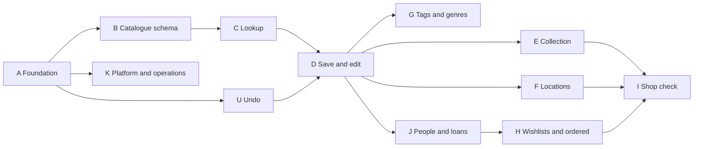

# Phase 1 story slicing

This shows how Phase 1 of the PRD splits into small slices that can each be reviewed in one sitting. It is input for epics and stories, not the stories themselves: acceptance criteria are written there. `AD-n` refers to [ARCHITECTURE-SPINE.md](ARCHITECTURE-SPINE.md). Screens are specified in [EXPERIENCE.md](../../ux-designs/ux-bookeh-2026-10-03/EXPERIENCE.md) and [DESIGN.md](../../ux-designs/ux-bookeh-2026-10-03/DESIGN.md); "UX" in the tables refers to the named part of EXPERIENCE.md.

Slice numbers are stable. A slice that was dropped keeps its number, listed under [Retired slices](#retired-slices); new slices take the next free number in their track.

## Slicing rules

1. **One concern per story.** A story is one collection, one service or one screen. If the title needs "and", split it.
2. **About 300 hand-written changed lines.** `payload-types.ts`, migrations, the lockfile and the import map don't count.
3. **A collection story contains only the collection.** That means the collection file, its access rules, hooks and constraints, the migration, and the two-user access test. No service and no screen.
4. **Schema stories merge one at a time.** After rebasing, the story regenerates its migration (AD-13).
5. **Services land before the screens that use them.** A screen story wires up behaviour that is already tested.
6. **Screens start read-only.** Each action on a screen (edit, delete, bulk move) is a follow-up story.
7. **Setup is its own story.** Adding a dependency or changing config is not mixed with a feature.
8. **Every story leaves `main` deployable**, with lint, typecheck and tests passing.
9. **A service that offers Undo ships its restore.** The receipt and a test that undoes the action are part of the service story (AD-20).

## Order

Tracks run mostly top to bottom. The two moments when the app becomes useful are marked in the track notes.

Recommended sequence: A, B, U, C, then D up to D17 for the first saved book, then E1, E16, E26, E17, E6, E21 and E8 for a browsable shelf, then the rest of D, F, J, H1 to H11, I, and the remainder in any order. K2 to K4 can start as soon as A is done and should finish before real cataloguing begins, so the 200 books go into the production database.

## A — Foundation

| # | Slice | Kind | Depends on | Governed by |
| --- | --- | --- | --- | --- |
| A1 | Bump Next.js to 16.3.8, Payload to 3.90.2 and the Node image to 22.23.3 | Setup | none | Stack |
| A2 | Push the repo to GitHub; workflow for lint, typecheck and tests with a Postgres service; add the `typecheck` script; fix `pnpm` in the Playwright config | Setup | A1 | Deployment seed |
| A3 | Postgres with ICU `fi-FI` and a pinned image tag, in Compose and CI; test that text sorts å, ä, ö after z | Setup | none | AD-7 |
| A4 | Test harness: `bookeh_test` database, `createUser()` and `as(user)`, unit-test glob | Setup | A3 | Tests |
| A5 | Remove the old collections and their tests; disable GraphQL and delete its routes | Cleanup | none | AD-10, AD-13 |
| A6 | Lint rules: layer imports with `no-restricted-imports`, `no-explicit-any` as an error | Setup | A5 | Paradigm, Types |
| A7 | Role helpers and `asRequestUser` in `src/access` | Library | A5 | AD-2, AD-3 |
| A8 | `users`: roles, display name, language, explicit access, admin-only `roles` and back office; access test | Collection | A4, A7 | AD-2, Accounts |
| A9 | First-user seed in `onInit` from environment variables | Setup | A8 | AD-3 |
| A10 | `lib/payload`: `requireUser`, `requireUserOrThrow`, context and gateway | Service | A8 | AD-2, AD-16 |
| A11 | `lib/payload`: `withTransaction` and the Drizzle helper | Service | A10 | AD-16 |
| A12 | `ownerField()`, `ownedRelation()` and `readableRelation()` in `src/fields`, tested on a throwaway collection | Library | A7 | AD-1, AD-17 |
| A13 | `lib/errors.ts`: `DomainError`, `ActionResult`, `runAction`, `runRoute` | Library | none | Errors |
| A14 | Tailwind 4 setup with its default scales cleared, and the token file from DESIGN.md, light and dark | Setup | none | Styling |
| A15 | `next-intl` setup with `en` and `fi` catalogues; locale from the profile or `Accept-Language` | Setup | A8 | AD-15 |
| A16 | Sign-in and sign-out; pages require a user and sign-in returns to the wanted address | Screen | A10, A14, A15 | AD-2, FR-1 |
| A17 | Toast provider in the root layout, rendering `ActionResult`; `flashToast` | Screen | A13, A14 | Toasts |
| A18 | `media`: signed-in read, catalogue-only create, random filenames; access test | Collection | A7 | AD-14 |
| A19 | Open Sans through `next/font` in the frontend root layout | Setup | A14 | Font |
| A20 | Base UI dependency, its import lint rule, and the first wrappers: dialog and sheet | Setup | A14 | UI primitives |
| A21 | Device preferences: the cookie, `devicePrefs()`, its action, and the theme attribute on the root element | Setup | A14 | Device preferences, Styling |
| A22 | Section shell: the four section headings, moving between them, Scan book on every section | Screen | A16, A19 | UX: Information Architecture |
| A23 | Remaining Base UI wrappers: combobox, menu, picker | Setup | A20 | UI primitives |
| A24 | `processState` helper for in-process state | Library | none | AD-12 |
| A25 | Client helper for actions and `/data` requests: no connection, signed out | Library | A13 | Errors |

## U — Undo

| # | Slice | Kind | Depends on | Governed by |
| --- | --- | --- | --- | --- |
| U1 | `lib/undo`: bounded receipt store, `withUndo`, `undo` | Service | A11, A13, A24 | AD-12, AD-16, AD-20 |
| U2 | `undoAction` and the Undo link on the toast, with its done and failed states | Screen | U1, A17 | AD-20, UX: Undo |

## B — Catalogue schema

| # | Slice | Kind | Depends on | Governed by |
| --- | --- | --- | --- | --- |
| B1 | `isbnField` with `normaliseIsbn`, and `nameKeyField`, with unit tests | Library | A4 | ISBN, Names |
| B2 | `bookFields` and `books`: visibility, `createdBy`, source, admin-only `rawMetadata`, ISBN constraints; access test; first migration | Collection | A12, B1 | AD-4, AD-5, AD-13, AD-19 |
| B3 | `authors` with visibility, `nameKey` constraints and `sortName`; access test | Collection | B2, B10 | AD-4, AD-19 |
| B4 | `series`, same rules without `sortName`; access test | Collection | B2 | AD-4, AD-19 |
| B5 | `genres`: shared only, admin-managed; access test | Collection | B1 | AD-4 |
| B6 | `user-books`: override fields, `overridden`, read, rating, `ratedAt`, unique per owner and Book; access test with a foreign id | Collection | B3, B4, B5 | AD-1, AD-6, AD-17, AD-19 |
| B7 | `copies`: owner, Book, status, notes; access test with a foreign id | Collection | B2 | AD-1, AD-8, AD-17 |
| B8 | `lib/books`: `EffectiveBook`, `UserBookState`, `getEffectiveBooks`, `coverUrl` | Service | B6 | AD-6, AD-10 |
| B9 | `lib/books`: `upsertUserBook` | Service | B8, A11 | AD-6, AD-18 |
| B10 | `sortNameField` with its derivation, unit-tested on Finnish and particle names | Library | A4 | AD-4 |

## C — Lookup

| # | Slice | Kind | Depends on | Governed by |
| --- | --- | --- | --- | --- |
| C1 | Source contract, `SourceResult` with author `sortName`, and the merge function, tested with fake sources | Library | B1 | AD-9 |
| C2 | Finna adapter, built from recorded raw responses | Adapter | C1 | AD-9 |
| C3 | Google Books adapter, built from recorded raw responses | Adapter | C1 | AD-9 |
| C4 | `lookupSources`: parallel calls with timeouts, the three outcomes, in-process cache | Service | C2, C3, A24 | AD-9, AD-12 |
| C5 | `findOrCreateByName` for authors and series, shared and private scope, with `sortName` from the source | Service | B3, B4, A11 | AD-4, AD-5, AD-18 |
| C6 | `lookupBook` by ISBN as entered: existing Book first, then sources; `LookupResult` with matches | Service | C4, C5, B8, E26 | AD-9 |
| C7 | Per-user rate limit on lookup | Service | C6 | AD-9, AD-12 |

## D — Save and edit

| # | Slice | Kind | Depends on | Governed by |
| --- | --- | --- | --- | --- |
| D1 | Ensure a shared Book from source data, with its authors and series | Service | C5, C4 | AD-3, AD-4, AD-5 |
| D2 | Cover download into `media`, outside the transaction | Service | D1, A18 | AD-14 |
| D3 | `createCopy` in `lib/copies` | Service | B7, A11 | AD-18 |
| D4 | `saveCopy`: one transaction, an owned copy, `requestId` repeat handling | Service | D1, D3 | AD-5, AD-11 |
| D5 | `editBook`: scalar edits on a shared Book become overrides | Service | B9, D1 | AD-5, AD-6 |
| D6 | Save undo: `saveCopy` returns its restore, deleting created records only when `isUnreferenced` | Service | D4, U1 | AD-3, AD-11, AD-20 |
| D7 | Private Book path: manual title and author, no source match | Service | D4 | AD-4, AD-5, FR-12 |
| D8 | ISBN auto-share of the user's own private Book during save | Service | D7 | AD-5 |
| D9 | Scan screen: camera with `@zxing/browser`, ISBN barcodes only, the ISBN field, no-camera state, X to leave | Screen | A22 | FR-10, UX: Scan |
| D10 | `Cover` component and the cover preview route handler | Screen | C4, B8 | AD-10, AD-14 |
| D15 | Playwright test: scan to save, with a fixture source and manual ISBN | Test | D17 | Tests |
| D16 | Answer on `/scan?isbn=`, Not in library, display only: Book, source, new-author notes, cover preview | Screen | D9, D10, C6 | AD-10, FR-13, UX: Answer screens |
| D17 | Add to library on the Answer: save action, toast, return to the scanner | Screen | D16, D4, A17 | AD-11, FR-15, FR-21 |
| D18 | Undo on the save toast | Screen | D17, D6, U2 | AD-20, FR-15 |
| D19 | `editBook`: author and series edits, private records for new names | Service | D5 | AD-5, AD-6 |
| D20 | `editBook` on the user's own private Book, which updates the Book | Service | D5, D7 | AD-5 |
| D21 | Edit book screen: first screen, More details, Save, Discard changes | Screen | D5, E21 | FR-13, UX: Edit book |
| D22 | Edit on the save toast: the new copy's status and location on Edit book | Screen | D21, D17, D24, F6 | AD-5, FR-28 |
| D23 | Scan loop rules: reading pauses during a lookup and an Answer, the same book is ignored until it leaves view, each Answer replaces the last in history | Screen | D17 | UX: Scan, History |
| D24 | `lib/copies`: set status, set note and remove; an ordered copy has no location | Service | D3 | AD-8, AD-18 |

After D17, the first book can be catalogued from the phone.

## E — Collection

| # | Slice | Kind | Depends on | Governed by |
| --- | --- | --- | --- | --- |
| E1 | Shelf query: `visibleCopies`, ordered ids by title, year and date added with Finnish sort, offset paging; two-user test | Service | B6, B7, A11, A3 | AD-3, AD-7 |
| E2 | Shelf query: text search over title, author, series, ISBN and notes | Service | E1 | AD-7, NFR-7 |
| E3 | Shelf query: scalar filters (publisher, year, language, page range, status, read, rating), several values per field | Service | E1, E16 | AD-7, FR-25 |
| E4 | Shelf query: relation filters (author, series, genre) with relation overrides, matching by `nameKey` | Service | E1, E16 | AD-6, AD-7, FR-25 |
| E6 | Collection screen at `/`: rows layout, search, count line, first page | Screen | E2, E17, D10, A22 | FR-23, FR-24, UX: Collection controls |
| E7 | Filter panel and sort on the collection screen | Screen | E3, E4, E6, E18 | FR-25, UX: Filter panel |
| E8 | Book detail, display only: sheet on the phone, side panel on wide screens, opened by `?book=` | Screen | E21, E26, B8, D10, A20 | FR-26, UX: Book detail |
| E11 | Read flag and rating in Book detail | Screen | E8, E24 | AD-8, FR-29 |
| E12 | Copy note editing and copy removal on a copy's line | Screen | E8, D24 | AD-18 |
| E13 | Admin re-fetch: fill-empty service and the admin-only action on Book detail | Service | E8, C4 | AD-5, FR-19 |
| E14 | Shelf query timing test at 10,000 copies | Test | E2, E3, E4 | NFR-3 |
| E15 | Shelf query: author sort on the first effective author's `sortName` | Service | E1, B3 | AD-4, AD-7 |
| E16 | `lib/shelf/query.ts`: `ShelfQuery`, `parseShelfQuery` and `shelfHref` with the `book` param, unit-tested | Library | none | AD-7 |
| E17 | `getShelfRows` by offset and limit: hydrated rows, total and filter labels | Service | E1, B8, E26 | AD-7 |
| E18 | Shelf values in use with copy counts, and suggestions for author, series and publisher at `/data/suggest` | Service | E1, A13 | AD-7, AD-10 |
| E19 | Endless scrolling: the `/data/shelf` handler, loading more, and the reload after a change | Screen | E6, A25 | AD-7, AD-10 |
| E28 | Remembering the list's row count and scroll position across routes | Screen | E19 | AD-7 |
| E20 | Covers layout and sizes s, m, l, remembered per device | Screen | E6, A21 | UX: Collection controls |
| E21 | `requireOwnBook` in `lib/books` | Service | B7 | AD-7 |
| E22 | Filter chips on Book detail | Screen | E8, E16 | FR-25, UX: Book detail |
| E23 | Select mode: ticking rows and the action bar, no actions yet | Screen | E6 | UX: Select mode |
| E24 | `setRead` in `lib/books`: for copies or a Book, with toggle and Undo | Service | B9, U1 | AD-18, AD-20 |
| E25 | Remove on a selection: service over a list of copies, and its confirmation | Service | E23, D24 | AD-18, FR-33 |
| E26 | `getHoldings` in `lib/books`: copy lines; later slices add location, loan and entry lines | Service | B7 | AD-9 |
| E27 | Mark read on a selection | Screen | E23, E24 | FR-33 |

## F — Locations

| # | Slice | Kind | Depends on | Governed by |
| --- | --- | --- | --- | --- |
| F1 | `locations` with `nameKey`, plus `copies.location` and `users.defaultLocation`; access test | Collection | B7 | AD-1, AD-17 |
| F2 | Default location in `createCopy`; location matching and inline creation in `lib/copies` | Service | F1, D3 | AD-18, FR-31 |
| F3 | Location on rows, on copy lines and as a shelf filter; absent when the user has no locations | Screen | F1, E7, E8 | FR-32 |
| F4 | Move on a selection and on a copy's line, with the location picker | Screen | F6, E23, A23 | FR-33 |
| F5 | Deleting a location clears it from copies and the profile default | Service | F1 | AD-18 |
| F6 | Move service over a list of copies, with Undo | Service | F2, U1 | AD-18, AD-20 |
| F7 | Rename and merge for locations | Service | F1 | AD-18 |
| F8 | Settings: the locations list with add, rename, merge and delete | Screen | F5, F7, K5 | UX: Settings |

## G — Tags and genres

| # | Slice | Kind | Depends on | Governed by |
| --- | --- | --- | --- | --- |
| G1 | `tags` with `nameKey`, and `user-books.tags`; access test | Collection | B6 | AD-1, AD-8 |
| G2 | The tag picker in Book detail and the tags field on Edit book | Screen | G7, E8, D21 | AD-18, FR-13, FR-26 |
| G3 | Tag filter in the shelf query and the Filter panel | Service | G1, E4 | FR-25 |
| G4 | Curated genre list: seed and admin management | Setup | B5 | AD-5; decides genre seeding |
| G5 | `mapSubjectsToGenres` and a re-run over stored subjects | Service | G4, D1 | AD-5 |
| G6 | Genre override on Edit book | Screen | G5, D21 | AD-6 |
| G7 | `changeTags` in `lib/books`: tag matching, add or remove for copies or a Book, with Undo | Service | G1, U1 | AD-18, AD-20 |
| G8 | Rename, merge and delete for tags | Service | G1 | AD-18 |
| G9 | Settings: the tags list | Screen | G8, K5 | UX: Settings |
| G10 | Tag on a selection, with the tag picker | Screen | G7, E23, A23 | FR-33 |

## H — Wishlists and ordered

| # | Slice | Kind | Depends on | Governed by |
| --- | --- | --- | --- | --- |
| H1 | `wishlists` with `nameKey`; access test | Collection | A12 | AD-1 |
| H2 | `wishlist-entries` with Book, optional Person, `closedAt`; access test with foreign ids | Collection | H1, B2, J1 | AD-1, AD-8, AD-17 |
| H3 | `saveEntry` in the save service, with its Undo receipt | Service | H2, D6 | AD-11, AD-20 |
| H5 | Wishlists section: the list of lists with counts, New list | Screen | H2, A22 | FR-39, UX: Wishlists |
| H6 | `closeEntry`: closes the entry, creates a copy unless it is for a Person; with Undo | Service | H2, D3, U1 | AD-18, AD-20, FR-28 |
| H7 | `closeEntriesForBook`: `saveCopy` closes the user's open entries for the Book and folds them into its restore | Service | H2, D6 | AD-11, AD-18 |
| H8 | Bought, Ordered and Remove on an opened entry | Screen | H6, H12 | FR-28 |
| H9 | Deleting a wishlist deletes its entries; rename | Service | H2 | AD-18 |
| H10 | Add to wishlist on the Answer and in Book detail, with the wishlist picker | Screen | H3, D16, A23 | FR-21, UX: Answer screens |
| H11 | One wishlist at `/wishlists/[listId]`: entries with recipients, Rename and Delete | Screen | H5, H9, B8 | FR-38, FR-39 |
| H12 | Opened entry at `?entry=`: Book header, its list, and the For field with its service | Screen | H11, J7 | AD-8, FR-38 |
| H13 | Received: service that makes an ordered copy owned at the default location, with Undo; its link on a copy's line | Service | F2, E8, U1 | AD-18, AD-20, FR-28 |

## I — Shop check

| # | Slice | Kind | Depends on | Governed by |
| --- | --- | --- | --- | --- |
| I1 | Answer heading precedence and fact lines from `Holdings` | Service | E26, F1, H2, J2 | AD-9, FR-20 |
| I2 | In library, Ordered and On wishlist Answers, with Open book, Add another copy and Received | Screen | I1, D17, E8, H13 | FR-16, FR-20, UX: Answer screens |
| I4 | `search()` on the Finna adapter | Adapter | C2 | AD-9 |
| I5 | `search()` on the Google Books adapter | Adapter | C3 | AD-9 |
| I6 | Lookup screen at `/scan/find`: two result groups, a result opens its Answer | Screen | I2, I10, I11 | AD-7, FR-20, UX: Lookup |
| I7 | Not found Answer, also at `/scan?title=`: title and author fields, then Add to wishlist or Add to library | Screen | D17, D7, H10 | FR-12, FR-22 |
| I8 | Playwright test: shop check | Test | I2, H10 | Tests |
| I9 | Answer when the sources did not answer | Screen | I7, C4 | AD-9 |
| I10 | `searchBooks` in `lib/catalogue`: merged hits, one per ISBN, shared rate limit | Service | I4, I5, C7 | AD-9 |
| I11 | Shelf text search over copies and open wishlist entries, with `visibleEntries` | Service | E2, H2 | AD-7 |
| I12 | `lookupBook` by Book id, for the user's own Books without an ISBN | Service | C6, E21 | AD-9 |

After I2, the first real shop check works.

## J — People and loans

| # | Slice | Kind | Depends on | Governed by |
| --- | --- | --- | --- | --- |
| J1 | `people` with `nameKey`; access test | Collection | A12 | AD-1 |
| J2 | `loans` with the one-open-loan constraint; access test with foreign ids | Collection | J1, B7 | AD-1, AD-8, AD-17, AD-19 |
| J3 | Lend and return services, with Undo | Service | J2, J7, U1 | AD-18, AD-20, FR-35, FR-36 |
| J4 | Lend and Returned on a copy's line in Book detail, with the Person picker and inline add | Screen | J3, E8, A23 | FR-35 |
| J5 | Loans section: by person and by date, the returned group, lent marker on collection rows | Screen | J3, E17, A22 | FR-37, UX: Loans |
| J6 | Deleting a copy deletes its loans | Service | J2, D3 | AD-18 |
| J7 | `lib/people`: match and create, rename, merge, and the delete rule | Service | J1 | AD-18 |
| J8 | Settings: the People list | Screen | J7, K5 | UX: Settings |
| J9 | Lent before: closed loans in Book detail | Screen | J3, E8 | FR-36 |

## K — Platform and operations

| # | Slice | Kind | Depends on | Governed by |
| --- | --- | --- | --- | --- |
| K1 | PWA manifest and icons, named bookeh | Setup | A14 | FR-50, Product name |
| K2 | Production image: `output: 'standalone'`, Dockerfile fixes, workflow builds and pushes to GHCR | Setup | A2 | Deployment seed |
| K3 | Production compose file on the LXC: pull, `prodMigrations`, bind mounts, `tailscale serve` | Setup | K2 | AD-12, AD-13 |
| K4 | Nightly backup script and timer; one rehearsed restore, written down | Setup | K3 | NFR-6 |
| K5 | Settings section: display name, language, theme, default location, sign out | Screen | A22, A21, F1, K9 | FR-4, UX: Settings |
| K6 | Back office tidy-up: collection groups, list columns, light theme | Setup | B7 | UI strategy |
| K7 | CI check that migrations apply to an empty database and none is missing | Setup | A2, B2 | AD-13 |
| K9 | `lib/account`: profile read and update | Service | A10 | AD-18 |

## Retired slices

Dropped on 2026-10-05, when the UX documents replaced review-before-save, the home screen and the detail page, and the Answer became a server-rendered page.

| # | Was | Replaced by |
| --- | --- | --- |
| C8 | Lookup route handler | D16; the `/scan` page renders the Answer |
| K8 | Change password | nothing; not in Phase 1 |
| D11 | Review screen, display only | D16 |
| D12 | Review screen save | D17, D21 |
| D13 | Undo on the save toast | D18 |
| D14 | Duplicate-copy warning on the review screen | I2 |
| E5 | Home screen | E6 |
| E9 | Inline editing of a shared Book's fields | D5, D19, D21 |
| E10 | Inline editing of a private Book | D20, D21 |
| H4 | Status picker on the review screen | D22, H10 |
| I3 | Add to wishlist and Mark bought on the result | D17, H10 |

## Slices most likely to outgrow the limit

| Slice | Why | How to split |
| --- | --- | --- |
| B2 `books` | Field set, access, two partial constraints | `bookFields` first, then the collection |
| C6 `lookupBook` | Four result kinds | Existing Book first, then the source kind with matches |
| D4 `saveCopy` | Transaction and repeat handling | Save first, then `requestId` |
| D21 Edit book screen | Form state, sparse edits, two parts | First screen with Save, then More details |
| E7 Filter panel | Many fields | One story per group: value lists, comboboxes, ranges and rating, sort |
| E8 Book detail | Two containers, several groups | The sheet first, then the side panel |
| C2 Finna adapter | MARC-flavoured records | Core fields first, then series, subjects and `sortName` |
| A22 Section shell | Headings, swipe, wrap-round | Headings and links first, then swipe |
| J5 Loans section | Two orders and a returned group | By date first, then by person, then returned |

Total: 147 slices across 12 tracks, with 11 numbers retired.
